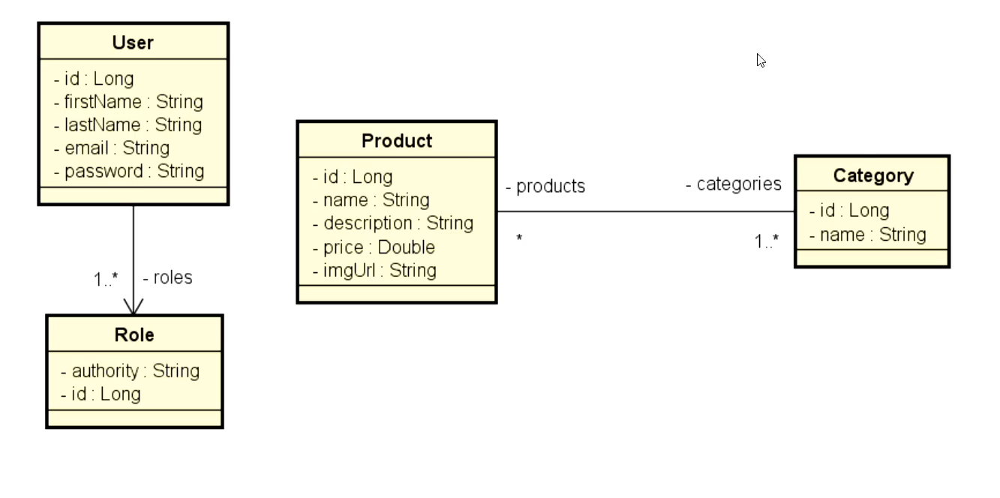

## Project Catalog



### Project Dependencies `maven`
```bash
<dependency>
	<groupId>org.springframework.boot</groupId>
	<artifactId>spring-boot-starter-web</artifactId>
</dependency>

<dependency>
	<groupId>org.springframework.boot</groupId>
	<artifactId>spring-boot-starter-data-jpa</artifactId>
</dependency>

<dependency>
	<groupId>com.h2database</groupId>
	<artifactId>h2</artifactId>
	<scope>runtime</scope>
</dependency>

<dependency>
	<groupId>org.postgresql</groupId>
	<artifactId>postgresql</artifactId>
	<scope>runtime</scope>
</dependency>

<dependency>
	<groupId>org.springframework.boot</groupId>
	<artifactId>spring-boot-starter-validation</artifactId>
</dependency>

<dependency>
	<groupId>org.springframework.boot</groupId>
	<artifactId>spring-boot-starter-security</artifactId>
</dependency>
```